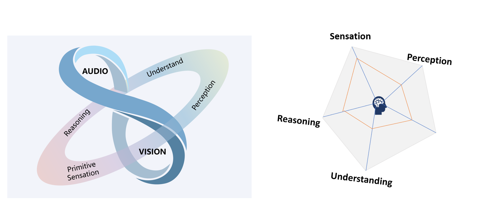
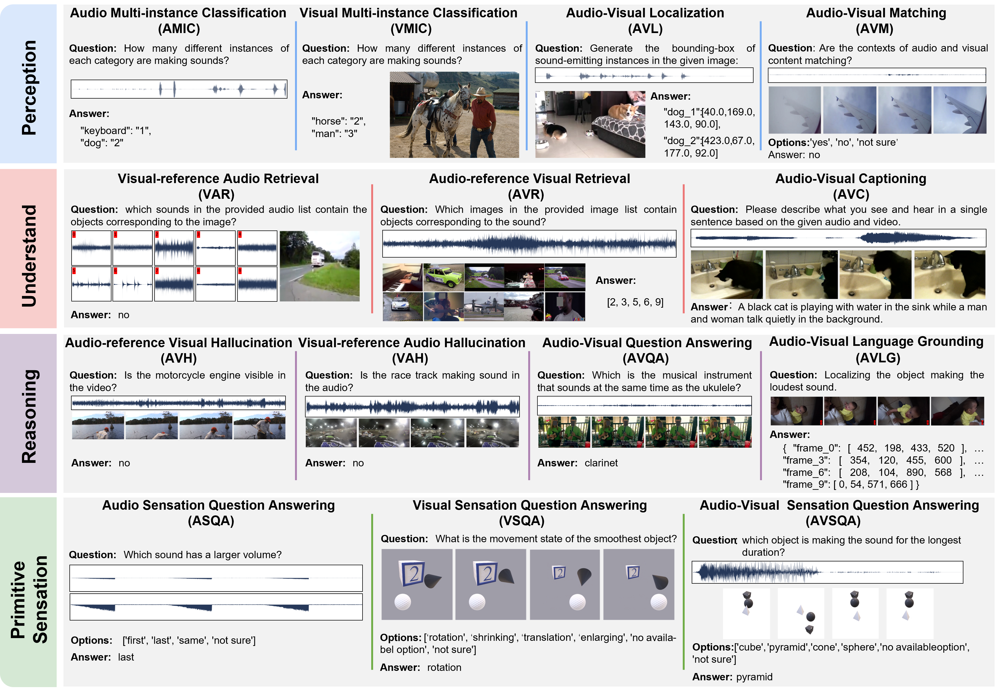

# AVI-Bench

**Toward Human-like Audio-Visual Intelligence of Omni-MLLMs**

<p align="center">
  
</p>

📄 [Paper](#) &nbsp;·&nbsp; 🌐 [Project Page](docs/index.html) &nbsp;·&nbsp; 📦 [Dataset](#)

AVI-Bench evaluates how well Omni-Multimodal Large Language Models (Omni-MLLMs) such as Gemini, GPT-4o, Qwen-Omni, and Baichuan-Omni handle joint audio-visual reasoning. It organises evaluation around the human cognitive process — *Perception → Understanding → Reasoning* — and adds the **Primitive Sensation (PriSe)** extension to test generalisation to low-semantic, unfamiliar audio-visual inputs.

This repository contains:

- the **14-task / 5,864-sample benchmark dataset layout** reported in the paper,
- a **unified inference + answer-formatting + evaluation pipeline**,
- a reference adapter for any **OpenAI-compatible API** (Gemini / GPT-4o / Claude / self-hosted),
- a **four-level AVI taxonomy** for principled cross-stage comparison.

---

## Table of Contents

- [Highlights](#highlights)
- [Benchmark Overview](#benchmark-overview)
- [Headline Results](#headline-results)
- [Repository Layout](#repository-layout)
- [Dataset Format](#dataset-format)
- [Quickstart](#quickstart)
- [Pipeline Details](#pipeline-details)
- [Adding a New Model](#adding-a-new-model)
- [Citation](#citation)
- [License](#license)

---

## Highlights

- **Cognitively Inspired Framework.** Three cognitively grounded stages (Perception, Understanding, Reasoning) plus the **Primitive Sensation (PriSe)** extension for unified, interpretable evaluation of Omni-MLLMs.
- **Primitive Sensation Extension.** A novel suite probing models' robustness on naive, low-semantic stimuli (synthetic 2D/3D shapes with controlled sounds) — directly tests generalisation beyond common training distributions.
- **Four-Level Intelligence Taxonomy.** Beyond raw accuracy, scores can be aggregated as Task-, Modality-, Stage-, and Domain-Adaptive intelligence, enabling fine-grained comparison.
- **Compact but rich.** 5,864 curated samples across 14 tasks — larger than most existing audio-visual benchmarks (WorldSense 3,172; AV-Odyssey 4,555) yet small enough to keep evaluation fast and reasoning-focused.
- **Production-ready pipeline.** Position-indexed concurrent inference, LLM-based answer refinement, and a metric suite covering full-match accuracy, mIoU, retrieval R@k, FENSE captioning, and counting RMSE.

---

## Benchmark Overview

<p align="center">
  
</p>

### Three Stages + Primitive Sensation

| Stage | Tasks | Samples | What it measures |
|-------|-------|--------:|------------------|
| **Perception** | AMIC, VMIC, AVL, AVM | 1,494 | Detection and recognition of fundamental audio/visual entities; cross-modal local + global alignment |
| **Understanding** | VAR, AVR, AVC | 808 | Integration of multimodal context (cross-modal retrieval, narrative captioning) |
| **Reasoning** | AVH, VAH, AVQA, AVLG | 1,472 | Higher-order inference; hallucination robustness; cross-modal grounding |
| **Primitive Sensation** | ASQA, VSQA, AVSQA | 2,090 | Sensitivity to low-semantic stimuli (texture / colour / spatial / temporal change) |
| **Total** | **14 tasks** | **5,864** | |

<p align="center">
  
</p>

### Task glossary

| Task | Full name | Cognitive stage | Metric |
|------|-----------|-----------------|--------|
| **AMIC** | Audio Multi-instance Classification | Perception | Semantic F1 + counting RMSE |
| **VMIC** | Visual Multi-instance Classification | Perception | Semantic recall + counting RMSE |
| **AVL** | Audio-Visual Localization | Perception | 0.7·mIoU + 0.3·Instance score |
| **AVM** | Audio-Visual Matching | Perception | Full-match accuracy |
| **VAR** | Visual-reference Audio Retrieval | Understanding | (R@1+R@3)/2 + F1 / 2 |
| **AVR** | Audio-reference Visual Retrieval | Understanding | same as VAR |
| **AVC** | Audio-Visual Captioning | Understanding | FENSE (Zhou et al., ICASSP'22) |
| **AVH** | Audio-reference Visual Hallucination | Reasoning | Full-match accuracy |
| **VAH** | Visual-reference Audio Hallucination | Reasoning | Full-match accuracy |
| **AVQA** | Audio-Visual Question Answering | Reasoning | Full-match accuracy |
| **AVLG** | Audio-Visual Language Grounding | Reasoning | per-frame mIoU |
| **ASQA** | Audio Sensation QA | Sensation | Full-match accuracy + double-confirm |
| **VSQA** | Visual Sensation QA | Sensation | Full-match accuracy + double-confirm |
| **AVSQA** | Audio-Visual Sensation QA | Sensation | AVSQA-specific matching + double-confirm |

### Primitive Sensation (PriSe)

Most existing benchmarks evaluate semantically rich audio-visual content (music, speech, real-world scenes), which overlaps heavily with model pre-training. AVI-Bench-PriSe instead measures whether Omni-MLLMs exhibit *primitive* sensation: detecting variations in colour, volume, shape, area, or temporal order on **synthetic, low-semantic stimuli** that lie outside the typical training distribution.

Each PriSe task includes paired **pre-question / formal-question** entries — a *double-confirm* mechanism that zeros the formal score whenever the model fails the basic "Can you hear / see anything?" pre-check, guarding against models that hallucinate confident answers without actually attending to the input.

### Four-Level AVI Taxonomy

| Level | Name | Definition |
|------:|------|------------|
| **L1** | Task-Adaptive | Per-task average score |
| **L2** | Modality-Adaptive | Balance between audio-dominant and visual-dominant tasks |
| **L3** | Stage-Adaptive | Whether reasoning is grounded in its perceptual / conceptual prerequisites |
| **L4** | Domain-Adaptive | Performance gap between familiar and unfamiliar (Sensation) domains |

L1–L4 yield interpretable diagnostic axes beyond raw accuracy.

---

## Headline Results

Top models on the main benchmark (selected rows). Full table in the paper.

| Model | Params | Perception | Understand | Reasoning | Sensation | **Overall** |
|-------|:-----:|---:|---:|---:|---:|---:|
| **Gemini-2.5-Pro** | – | 54.58 | 68.97 | 69.06 | 36.22 | **57.21** |
| Gemini-2.5-Flash | – | 45.97 | 43.79 | 63.70 | 30.63 | 46.02 |
| Gemini-2.0-Flash | – | 44.27 | 42.11 | 64.03 | 29.48 | 44.97 |
| Qwen2.5-Omni | 7B | 42.81 | 39.68 | 58.26 | 24.59 | 41.33 |
| GPT-4o | – | 40.45 | 48.60 | 56.87 | 16.81 | 40.68 |
| Human (subset) | – | – | – | – | 90+ | **92.6** |

**Key observations:**
- Even the top model, Gemini-2.5-Pro, reaches only **57.2**, far below the human baseline (~92.6), confirming AVI-Bench is a challenging frontier.
- A consistent **modality imbalance** is observed: most models excel on visual-dominant tasks but lag on audio-dominant ones, highlighting audio intelligence as a bottleneck.
- **Primitive Sensation** is the weakest stage across the board, indicating poor generalisation to low-semantic, unfamiliar inputs.

---

## Repository Layout

```
AVIBench/
├── README.md
├── run.py                          # unified inference entry
├── run_all.sh                      # wrapper to run all tasks
├── test_one_task.py                # smoke test single task
├── test_all_tasks.py               # smoke test all tasks (5 samples each)
│
├── scripts/                        # prompt assembly + dataset loader
├── models/                         # model adapters
│   └── gemini/run.py               # OpenAI-compatible API client
├── auto_format/                    # LLM-based answer refining
└── eval/                           # FENSE-aware evaluation
    ├── eval.py
    ├── level_metrics/
    ├── user_outputs/{model}/tasks/*.json
    ├── user_outputs_refined/{model}/tasks/*.json
    └── eval_outputs/{model}.json
```

The benchmark data lives separately (e.g. `AVIBench_data_release/levels/`) — see [Dataset Format](#dataset-format).

---

## Dataset Format

```
levels/
├── perception/
│   ├── AMIC/   ├── VMIC/   ├── AVL/   └── AVM/
├── understand/
│   ├── VAR/    ├── AVR/    └── AVC/
├── reasoning/
│   ├── AVH/    ├── VAH/    ├── AVQA/  └── AVLG/
└── sensation/
    ├── ASQA/   ├── VSQA_I/ ├── VSQA_V/ └── AVSQA/
```

Each task folder contains `data.json` (a list of sample entries) and an `input/` directory with the media files. A typical entry:

```jsonc
{
  "id": "00000",
  "task": "AVQA",
  "subtask": null,
  "input": {
    "question": {
      "prompt": "prompt_avqa",
      "text": "Answer the question based on the given audio and video. Question: Is there a voiceover?",
      "options": "avqa_options_list_is"
    },
    "video": "./input/videos/00000.mp4",
    "audio_list": null,
    "image_list": null
  },
  "output": {
    "question_answer": "yes"
  }
}
```

`prompt` and `options` are *pseudo keys* (e.g. `"prompt_amic"`) resolved at runtime against `scripts/definitions.py`, so `data.json` stays compact.

---

## Quickstart

### 1. Environment

```bash
conda create -n avibench python=3.11 -y
conda activate avibench
pip install -r requirements.txt          # openai, nltk, aac-metrics, sentence-transformers, ...
```

Point at the unpacked dataset and configure your API gateway:

```bash
export DATA_ROOT=/path/to/AVIBench_data_release/levels
export OPENAI_API_KEY=...                # your OpenAI-compatible gateway key
export OPENAI_BASE_URL=...               # your OpenAI-compatible gateway endpoint
```

### 2. Smoke test

```bash
python test_all_tasks.py                 # 5 samples per task; finishes in minutes
```

### 3. Three-step pipeline

```bash
# (a) Inference — produces eval/user_outputs/<model>/tasks/*.json
MODEL_PATH=gemini-2.5-pro MODEL_LABEL=gemini-2.5-pro \
DATA_ROOT=$DATA_ROOT bash run_all.sh

# (b) Refine — produces eval/user_outputs_refined/<model>/tasks/*.json
cd auto_format && python run.py && cd ..

# (c) Evaluate — produces eval/eval_outputs/<model>.json
cd eval && python eval.py --models gemini-2.5-pro
```

---

## Pipeline Details

### 1. Inference

`run.py` is the unified entry. Tasks run as independent processes (one per task) and parallelise trivially across processes.

| Flag | Default | Purpose |
|------|---------|---------|
| `--model_path` | `gemini-2.5-pro` | Model identifier passed to the API |
| `--model_label` | `gemini-2.5-pro` | Logical model name (used in output paths) |
| `--tasks` | all tasks | Subset of tasks to run |
| `--data_root` | `./data/levels` | Path to dataset root |
| `--output_dir` | `./eval/user_outputs` | Where to write `<model_label>/tasks/*.json` |
| `--concurrency` | `1` | Concurrent requests per task |
| `--n_samples` | None | Cap samples per task (for quick tests) |

Predictions are written at their dataset array position and resumable: re-running the same command skips slots that already have valid predictions.

### 2. Answer Formatting (Refine)

Raw model outputs are free-form text. A second LLM ("refine") normalises them per task:

| Task family | Refine output format |
|-------------|----------------------|
| QA (ASQA, VSQA, AVSQA, AVQA) | Stripped final answer (`**option**` or number) |
| Multi-instance counting (AMIC, VMIC) | `{"class": "count"}` dict |
| Retrieval (AVR, VAR) | Index list `[0, 3, 7]` |
| Localization (AVL) | `{"category_id": "[x_min, y_min, x_max, y_max]"}` dict |
| Video grounding (AVLG) | `{"frame_0": [x,y,w,h], ..., "frame_9": ...}` |
| No refine needed (AVM, AVC, AVH, VAH) | Passed through |

Configure via env vars: `OPENAI_API_KEY`, `OPENAI_BASE_URL`, `REFINE_MODEL` (default `gemini-2.5-flash`), `REFINE_CONCURRENCY` (default 8).

### 3. Evaluation

```bash
cd eval
python eval.py                                # eval all models under user_outputs_refined/
python eval.py --models gemini-2.5-pro        # eval one specific model
```

Output: `eval/eval_outputs/<model_label>.json` with per-task and stage-aggregated scores.

```jsonc
{
  "perception":  { "amic": {...}, "vmic": {...}, "avl": {...}, "avm": 0.768 },
  "understand":  { "var": {...}, "avr": {...}, "avc": {"fense": 0.56, ...} },
  "reasoning":   { "avh": 0.86, "vah": 0.80, "avqa": 0.40, "avlg": 0.35 },
  "sensation":   { "asqa": 0.29, "avsqa": 0.16, "vsqa": 0.32 }
}
```

For FENSE (AVC), the evaluator downloads two HuggingFace models on first use: `sentence-transformers/paraphrase-TinyBERT-L6-v2` and `bert-base-uncased`. Set `HF_HUB_OFFLINE=1` once they are cached.

---

## Adding a New Model

1. Create `models/<your_model>/run.py` exposing `set_model()` and `get_response()` (see `models/gemini/run.py` as a reference).
2. Select it via `MODEL_BACKEND=<your_model>`:

   ```bash
   MODEL_BACKEND=your_model \
   MODEL_PATH=your-model-id MODEL_LABEL=your-model \
   bash run_all.sh
   ```

The refine + eval pipeline is model-agnostic — your results land at `eval/eval_outputs/your-model.json` without any extra plumbing.

---

## Citation

If you use AVI-Bench in your research, please cite:

```bibtex
@inproceedings{wang2026avibench,
  title     = {AVI-Bench: Toward Human-like Audio-Visual Intelligence of Omni-MLLMs},
  author    = {Wang, Yaoting and Zhang, Ziyi and Tu, Wenming and Xu, Shaoxuan and Du, Wenjie and Liang, Cheng and Wang, Weijun and Li, Yuanchao and Li, Guangyao and Fei, Hao and Li, Yuanchun and Ding, Henghui and Liu, Yunxin},
  booktitle = {Proceedings of ICML},
  year      = {2026}
}
```

For the FENSE captioning metric used in AVC, please also cite Zhou et al., ICASSP 2022.

---

## License

Code is released under the MIT License. The dataset itself bundles content from several public sources (MusicAVQA, AV-Caps, AVHBench, ...) — see the dataset release for per-source attribution.
